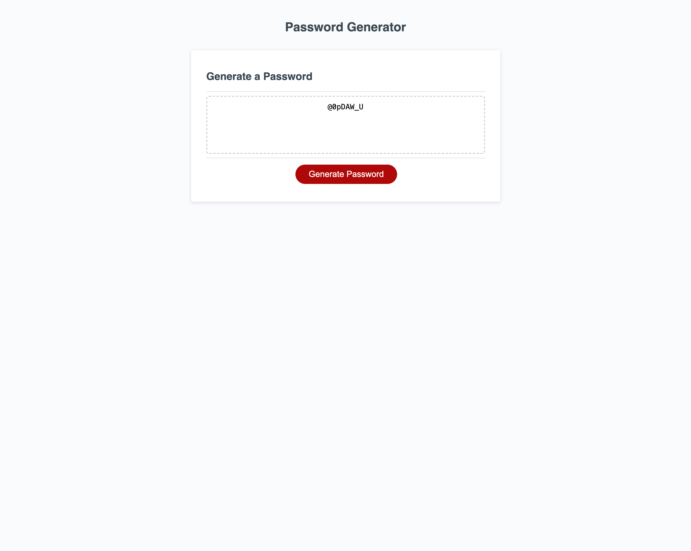

# password-generator

## Description
This is a basic random password generator,  that is based on the user preference. It can create random passwords using special characters, lower and uppercase letters and can be a specific length, chosen by the user.

## Mock Up

## Link to Application
https://agrig33.github.io/password-generator/

## Link to Github Repository
https://github.com/Agrig33/password-generator

## References
https://www.w3schools.com/js/js_functions.asp
https://www.w3schools.com/js/js_if_else.asp
https://www.w3schools.com/js/js_random.asp